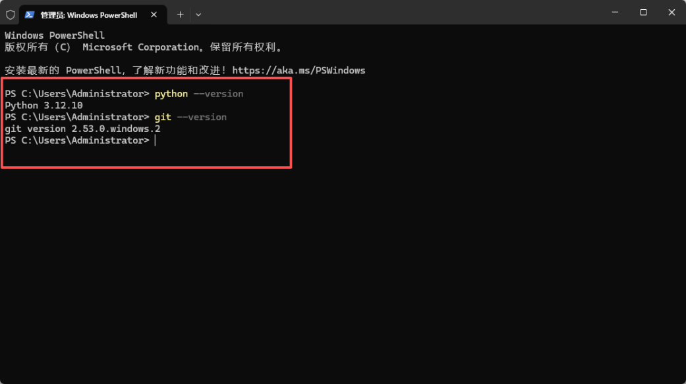
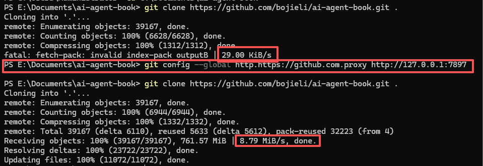
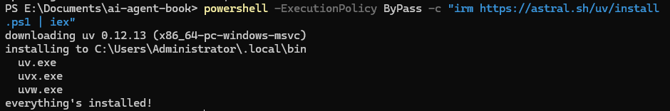
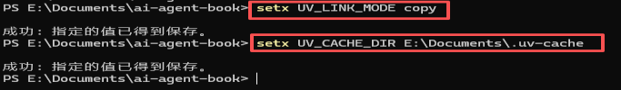
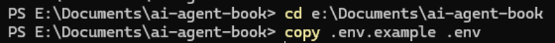
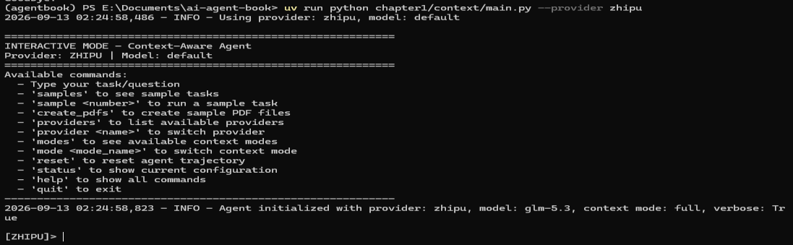
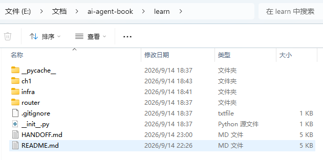
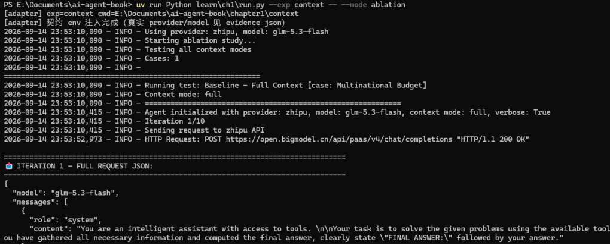
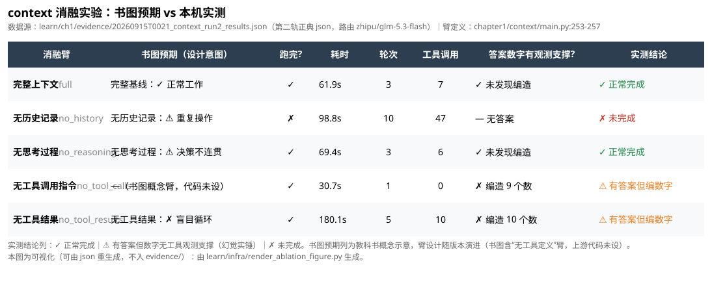

# Task 0 学习笔记（按操作步骤）

> 状态：AI 起草（2026-09-15，据本人 docx 心得与过程影像整理）→ **本人已精校**（2026-09-15）。
> 🖊️ 标记段 = 本人体会槽位，观点由本人撰写（AGENTS.md 分工边界），AI 不代写。
> 分层阅读：命令层看 [Task0操作手册](Task0操作手册.md) ｜ 坑位层看 [../research/Task0坑位全盘查.md](../research/Task0坑位全盘查.md) ｜ 本文 = 叙事层。
> 影像：本人截图存 [notes/assets/](../assets/)，命名 `20260914_stepN_slug`；每个 Step 关键图内嵌，其余以链接附在本步末尾。
> 证据：实验产物记录（json 正典）存 [ch1/evidence/](../../evidence/)，png 副本本地可重生成。

***

## Step 1 · 基础环境检查 ✅

检查 Python / git / 网络等基础环境，全部通过。

🖊️ 精校：学习要抱着从0开始的心态，基础的动作必须要做

## Step 2 · 克隆 ai-agent-book 仓库 ✅

国内网络 clone 仅 20-30KiB/s，配置加速代理与 git 全局代理后达 8-9MiB/s，克隆成功并核对目录结构。

- 坑位：A1（clone 低速 → 代理）

- 其余影像：[检查文件夹通过](../assets/20260914_step2_folder_check.png)

🖊️ 精校：影响效率的问题（也是基础的配置问题，国内网络必须加代理克隆），必须及时处理，不然会拖慢整个项目

## Step 3 · 安装 uv（包管理器）✅

安装 uv 并验证通过。（注：本步为开营当日历史路径；后续实测本机沙箱内 uv 受限，现行 Python 统一走 `.venv\Scripts\python.exe`，见操作手册「环境基线」。）

- 其余影像：[uv 验证通过](../assets/20260914_step3_uv_verify.png)

🖊️ 精校：其实是因为Agent沙箱和真实环境有隔离，所以Agent沙箱内运行powershell不能走uv，真实环境不受影响。

## Step 4 · 安装第 1 章依赖 ✅

uv 缓存目录在 C 盘、项目在 E 盘，跨盘符无法硬链接报 warning；设置 uv 缓存路径与链接模式环境变量后复跑通过。

- 坑位：A2（跨盘符硬链接）

- 其余影像：[踩坑报错](../assets/20260914_step4_uv_cachewarn.png)｜[再次运行验证通过](../assets/20260914_step4_uv_reverify.png)

🖊️ 精校：emmm，怎么说呢，也是基础配置问题。

## Step 5 · 设置 API KEY ✅

从根 [.env.example](../../../.env.example) 拷贝 `.env`，填入 API KEY，并验证 `.env` 在 .gitignore 排除名单内。

- 铁律：key 只进根 `.env`，不进聊天 / 截图 / 提交（本步截图中的 key 已打码）。

- 其余影像：[填入 API KEY](../assets/20260914_step5_env_key.png)｜[验证 .env 在排除名单](../assets/20260914_step5_env_gitignore.png)

🖊️ 精校：emmmmm，更基础的一个配置和检查。

## Step 6 · 运行第一章 main.py 连接大模型 ✅

两个坑：uv 未激活且未显式指定 provider（带显式 provider 参数执行后成功连接智普）；上游 main.py 对 create\_sample\_pdf.py 的相对路径假设报错——当时临时改上游两处为绝对路径，后按「上游零修改」铁律还原，由 run.py 以 cwd=实验目录 启动根治（详见坑位 B1）。

- 坑位：C1（uv / provider）、B1（PDF 路径假设）

- 其余影像：[报错](../assets/20260914_step6_mainpy_err.png)｜[PDF 路径报错](../assets/20260914_step6_pdfpath_err.png)｜[处理](../assets/20260914_step6_pdfpath_fix.png)｜[命令行验证成功](../assets/20260914_step6_pdfpath_ok.png)

🖊️ 精校：没仔细看教学文档，实验都有简单路由，但始终不方便，我在learn下加了任务路由，还有适配层。

## Step 7 · 搭建 learn 目录（含主仓注入适配器和任务模型路由）✅

建立 `learn/` 学习容器：notes 双轨、probes 能力探测（t1–t12）、evidence 第二轨验收、router 任务模型路由、infra 公共设施；上游文件零修改。

- 结构与约定详见 [learn/README.md](../../README.md)；fork 仓库：<https://github.com/rg8diaoa/ai-agent-book>

🖊️ 精校：保持原仓（教学主仓）净室，所有个人学习相关等都放到learn，而且更好管理和追溯，以免混淆主仓的教学原理、路径、目标。

## Step 8 · 进行 context 实验 ✅

先修两个适配层坑（--evidence 模式静默捕获输出 → 加流式打印；GBK/emoji 编码崩溃 → 强制 UTF-8），随后 context 消融实验完整跑通：结果表、对比矩阵、分析总结依次输出，证据 json 落盘 `learn/ch1/evidence/`。

- 坑位：D1（静默捕获）、A3（GBK 编码）

- 其余影像：[无流式输出现场](../assets/20260914_step8_nostream_err.png)｜[流式打印修复](../assets/20260914_step8_nostream_fix.png)｜[GBK 报错](../assets/20260914_step8_gbk_err.png)｜[编码修复](../assets/20260914_step8_gbk_fix.png)｜[消融结果表](../assets/20260914_step8_ablation_results.png)｜[对比矩阵](../assets/20260914_step8_ablation_matrix.png)｜[分析总结](../assets/20260914_step8_analysis_summary.png)

- 证据：[20260914T162109\_run\_context.json](../../evidence/20260914T162109_run_context.json)｜[20260915T0021\_context\_run2\_results.json](../../evidence/20260915T0021_context_run2_results.json)

- 可视化（书图预期 vs 本机实测，由上方 run2 json 重生成，不入 evidence/）：

🖊️ 精校：windows下问题不少，给所有报错都处理了，值得记录的就只有emoji报错和子进程静默，全部修改的适配层代码，不影响原仓代码。

## 收尾 · 归档与入库 ✅

心得 docx 转三件套（学习笔记 / 操作手册 / 坑位全盘查），assets 语义化重命名（`20260914_stepN_slug`），登记 learn/README.md；待本人精校确认后提交。

🖊️ 精校：因为同一个文档不方便管理，而且因为Agent协作和便于以后回溯的原因，需要分轨存放更好，虽然没那么方便。

## 复盘三问

已列于 [../research/Task0坑位全盘查.md](../research/Task0坑位全盘查.md) 的「人工复盘」一节（**已作答**，2026-09-15 本人手写）：

1. A1–A3 三个环境坑的共同根因是什么？「权威源」应按什么优先级排序？
2. D1 的定位（读适配层源码找捕获逻辑）与 A3 的定位（顺编码链路分析）还能迁移到什么排查场景？
3. 用自己的话重述 B1 的原则（上游代码的路径/资源假设与运行目录相关），并各举一个 Task 0 之外的新例子。

## 交付物清单

| 层       | 文件                                           |
| ------- | -------------------------------------------- |
| 叙事层（本文） | `notes/guides/Task0学习笔记.md`                  |
| 命令层     | `notes/guides/Task0操作手册.md`                  |
| 坑位层     | `notes/research/Task0坑位全盘查.md`               |
| 影像层     | `notes/assets/` 25 张（本人截图，过程影像）              |
| 证据层     | `ch1/evidence/`（json 正典入库，png 本地重生成）         |
| 协作规则    | 根 `AGENTS.md`                                |
| 源文档     | `notes/CC_Task0学习心得.docx`（原始 docx，精校后归档与否待定） |

